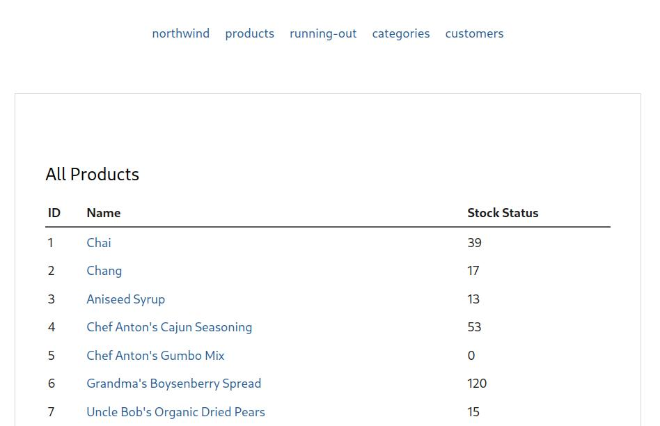

🏁 A fully-functional demo website that uses this plugin is available at
[northwind.captnemo.in](https://northwind.captnemo.in). The source code for
the demo is available at [captn3m0/northwind](https://github.com/captn3m0/northwind).
You can find more details at the demo page.

Here is a screenshot:

It relies on all features of the plugin, along with using `jekyll-datapage_gen`
plugin to generate individual pages for each data item.

1. A [per-page query](usage/#per-page-queries) is used on the restock page to generate list of
   products that need to be restocked. [source](https://github.com/captn3m0/northwind/blob/main/restock.md?plain=1)
2. Customers, Orders, Products, Categories are set as global data items
   in [config.yml](https://github.com/captn3m0/northwind/blob/main/_config.yml)
3. `site.data.categories[*].products` is filled using a parameterised query
   in [`config.yml`](https://github.com/captn3m0/northwind/blob/main/_config.yml#L47-L49)
4. Featured Product and Employee of the Month, shown on homepage are set by a query
   in `config.yml`, but the query parameters are set in [`_data`](https://github.com/captn3m0/northwind/tree/main/_data)
   directory as YML files.
5. The datapage plugin config generates a page for every product and customer.
6. A multi-level nested query is used to generate a list of employees. See [Nested Query]() in docs.

The database is a trimmed-version of the northwind database from <https://github.com/jpwhite3/northwind-SQLite3>.
