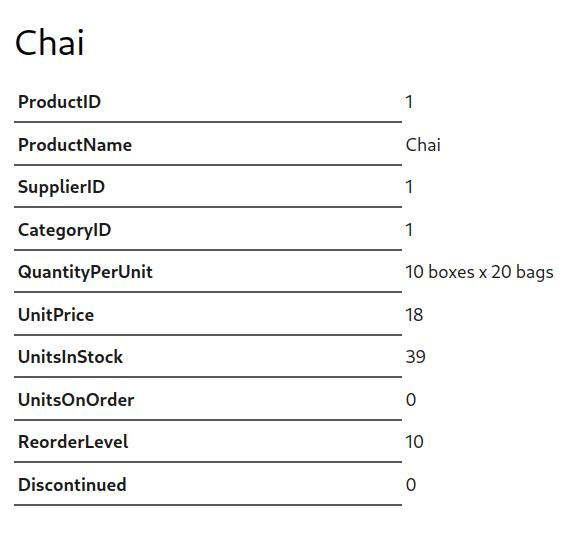

The Jekyll [Datapage Generator](https://github.com/avillafiorita/jekyll-datapage_gen)
plugin allows you to specify data files for which we want to
generate one page per record.

You can use it alongside this plugin to generate data from a SQLite database,
and generate a page per row of your resultset.

This is how a simple configuration would look:

```yaml
# for the sqlite plugin
sqlite:
  - data: restaurants
    file: _db/reviews.db
    query: SELECT id, name, last_review_date > 1672531200 as active, address FROM restaurants;

# for the datapage_gen plugin
page_gen:
  - data: restaurants
# The layout used for each generated page _layouts/restaurant.html
    template: restaurant
    page_data_prefix: restaurants
    name: id
    title: name
    filter: active
```

This will automatically generate a file for each restaurant `restaurants/#
{id}.html` file with the layout `_layouts/restaurant.html` and page.id,
page.name, page.active set and page.title set to restaurant name. Query data is
accessed in the page template via `{{ page.restaurants.address }}` - the
namespace set in `page_data_prefix`.

Note that the `datapage_gen` plugin will run _after_ the `jekyll-sqlite` plugin, if you generate any pages with per-page queries, these queries will not execute.

## Demo Example

The following example comes from the [Demo]().

The following datapage configuration in `_config.yml`:

```yml
page_gen:
- data: products
  template: product # _layouts/product.html
  page_data_prefix: product
  title: ProductName
  name: ProductID
  extension: html
```

will generate a page for each product in the `site.data.products` array.

In order to get data into the array, we can use:

```yml
sqlite:
  - data: products
    file: _db/northwind.db
    query: SELECT * from Products
```

Here's a screenshot of how it looks:



See it in action at <https://northwind.captnemo.in/products/1.html>